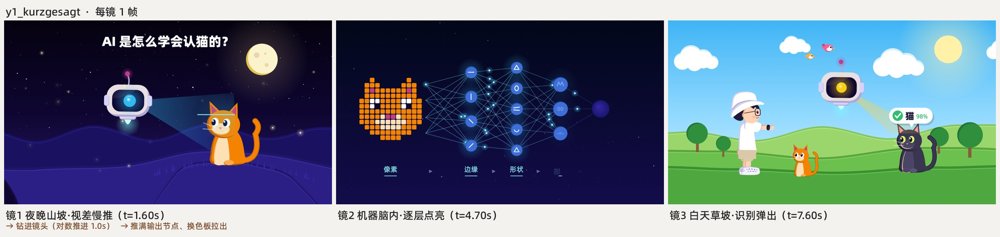
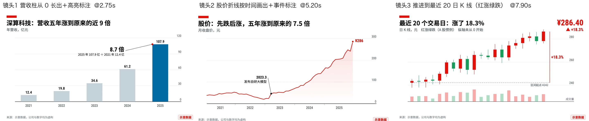

# onai-art-motion

Claude монтирует и анимирует кодом в 35 художественных стилях. Картины в кадре двигаются.

Оригинальный README на китайском сохранён в [README.zh.md](README.zh.md).

## Откуда

Это форк навыка [huashu-art-motion](https://github.com/alchaincyf/huashu-art-motion) китайского автора 花叔 Huashu. Лицензия MIT, подробности в [NOTICE.md](NOTICE.md).

Что добавлено в этой версии:

- русский язык: README, SKILL.md и указатель стилей;
- режим ONai для вертикальных рилсов 9:16 под готовую озвучку, где каждая мысль живёт в своём художественном мире.

35 роликов, по одному кадру из каждого: одна и та же девушка, один и тот же рыже-белый кот, один и тот же стол, от пещеры 40 000 лет до н. э. до 2026 года. В каждом кадре что-то движется: звёздное небо Ван Гога крутится, цвет на мозаике перетекает с камня на камень, тушь уводит кадр в следующую эпоху.

## Что умеет

| Ты говоришь | Навык делает |
|---|---|
| «Смонтируй мой рилс в стиле ONai» | Карта миров по смысловым блокам озвучки, сквозной предмет, 3D-слой, вертикаль 9:16 (режим ONai) |
| «Повтори эту анимацию», «разбери этот фрагмент» | Запускает скрипт разбора: меряет переходы, сетку ритма и карту движения по сегментам, затем повторяет по механике кодом |
| «Сделай анимацию в стиле Ван Гога, Моне или Баухауса» | Сначала проектирует один кадр, потом оживляет его; 35 карточек стилей служат отправной точкой |
| «Сделай художественную анимацию по моей озвучке» | Таблица планов, выбор стиля, холст мира с камерой, выдаёт одну дорожку изображения |
| «Сделай ролик, где человек проходит сквозь картины» | Скелет длинного свитка: на каждый мир свой файл, герой идёт вправо, на границе меняется манера живописи, камера только приближается |
| «Сделай анимацию для объясняющего видео» | Выбирает язык по озвучке, получает JSON, отдаёт фрагмент с длительностью до кадра (горизонталь, вертикаль, прозрачный фон) |
| «В кадре должен быть человек» | Человека рисует модель изображений, код собирает, меняет кадры и накладывает материал |
| «Подложи музыку, попади в ритм» | Сетка BPM, мотив меняет инструмент, звуковая серия в конце; всё синтезируется кодом |

Перед сдачей идёт числовая проверка: `qa.py` меряет устойчивость, эффективность, динамику, плавность и признаки текста за рамкой кадра. Затем независимый агент смотрит только готовый ролик и ищет проблемы.

## 35 стилей

Полная таблица с оценками и слабыми местами: [references/风格配方/INDEX.ru.md](references/风格配方/INDEX.ru.md).

- Пещерная живопись, египетская фреска, аттическая вазопись, помпейская мозаика, готическая рукопись с золотом, ренессанс со сфумато.
- Импрессионизм, Ван Гог, Муха и ар-нуво, аналитический кубизм, Баухаус, поп-арт Лихтенштейна.
- 8-бит, ранний CGI с трассировкой лучей, современная плоская иллюстрация.
- Китайская тушь, Климт, Мунк, дуньхуанская фреска, Кусама, русский конструктивизм, Дали, Хоппер.
- Гибли, вейпорвейв и неон, Marvel эпохи Kirby, Моне, Сёра, Матисс, Кит Харинг, Рембрандт.
- Мультфильм 1930-х с резиновыми шлангами, китайский театр теней, Синкай, Пикассо голубого периода.

В нумерации нет карточки 07, так задумано в оригинале.

## 9 языков роликов

Для объясняющих видео есть 9 грамматик. У 8 из них есть рабочий образец, параметрические фрагменты и пример спецификации; девятая (ведущий) даётся как опорный код и требует собственного персонажа.

| | |
|---|---|
|  Kurzgesagt: плоская графика без обводки, переходы по масштабу |  Vox: газетные вырезки, красные линии, маркер |
|  Белая доска: кончик пера открывает линейный рисунок |  3Blue1Brown: один объект перетекает в следующий |
|  Storytime: крупные реакции, паузы на шутку |  Кинетический текст: главное слово врезается в кадр |
|  Презентация: световые пятна, матовое стекло, крупные цифры |  Финансовые графики: сначала оси, потом данные, подсвечена одна мысль |

Девятая грамматика, ведущий-рассказчик для финансов и науки, поставляется как карточка грамматики и код целого ролика, нужен свой персонаж.

## Режим ONai

Режим для вертикальных рилсов под готовую озвучку. Подробно: [references/onai-reels.md](references/onai-reels.md).

- Озвучка разбивается на смысловые блоки по 3-7 секунд, каждому блоку свой художественный мир из 35 стилей, не меньше 5 миров в минуту.
- Мир выбирается по смыслу фразы: деньги в Баухаус или конструктивизм, ностальгия в 8-бит, мечта в Гибли или Синкая.
- Один узнаваемый предмет из темы проходит через все миры и переносит действие из блока в блок.
- Хук в первые 3 секунды: движущийся кадр и огромный текст языком первого мира, без заставки.
- Поверх каждого мира один 3D-объект по смыслу, камера двигается в глубину.
- Спикер внизу полосой в 35% высоты, графика сверху, важное не заходит в нижние 35% кадра.
- Финал в 4K 2160×3840, перед сдачей `qa.py` и независимый просмотр.

Демо «длинного свитка» и герой оригинала требуют своих кадров персонажа: файлы с образом автора оригинала в этот репозиторий не входят.

## Как установить

Открой Claude Code и напиши:

> Установи навык из github.com/saint4ai/onai-art-motion и всё, что ему нужно для работы.

Claude сам поставит uv, ffmpeg и браузер для рендера.

## Первый запрос

> Вот моя озвучка voice.mp3. Смонтируй рилс 9:16 в стиле ONai: хук в стиле египетской фрески, дальше Моне, 8-бит и Климт.

## Благодарности

- **花叔 Huashu** ([alchaincyf](https://github.com/alchaincyf)): автор исходного навыка huashu-art-motion, всё ядро (движок, 35 стилей, грамматики, проверки) принадлежит ему.
- **Tak** ([@cherry_mx_reds](https://x.com/cherry_mx_reds)): ролик «Art History Speedrun» стал отправной точкой навыка. Кадры оригинального ролика в репозиторий не входят.

Шрифты распространяются по лицензии SIL OFL 1.1, данные штрихов по Arphic Public License; тексты лицензий лежат рядом с файлами. Лицензия кода и документов: MIT, см. [LICENSE](LICENSE) и [NOTICE.md](NOTICE.md).

## Автор русской версии

Александр, Instagram [@saint4ai](https://instagram.com/saint4ai).
